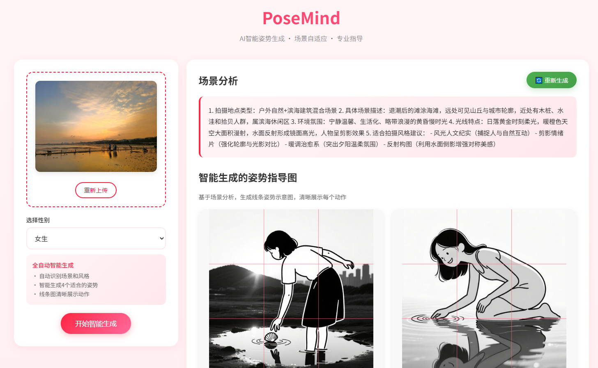

# PoseMind

<div align="center">


**AI智能姿势生成系统，让摄影更简单**

*智能场景识别 • 自动姿势生成 • 专业指导*

[English](README_EN.md) • [功能特性](#-功能特性) • [快速开始](#-快速开始) • [部署](#-部署)

</div>

---

## 📸 项目展示

<div align="center">

### 上传界面


*简洁美观的上传界面，支持拖拽上传*

### 生成结果


*AI场景分析 + 智能姿势生成 + 线条图指导*

</div>

---

## 📖 关于

PoseMind 是一个AI驱动的摄影姿势推荐系统，能够自动分析场景并生成个性化的姿势建议。使用先进的视觉模型和图像生成AI，为您的照片创建专业的姿势指导图。

### 核心特性

- 🧠 **AI场景分析** - 自动识别环境、光线和氛围
- 🎯 **智能姿势生成** - 根据场景实时生成独特姿势
- 🎨 **线条图指导** - 生成清晰的姿势示意图
- 🚀 **全自动化** - 只需选择性别，其他全部AI完成
- 🌸 **精美UI** - 现代化响应式设计

---

## ✨ 功能特性

### 🧠 AI智能场景识别
- 自动环境分析（室内/户外/城市/自然）
- 氛围检测（休闲/正式/浪漫/活力）
- 光线评估（自然光/人工光/逆光）

### 🎯 智能姿势生成
- **无固定姿势列表** - AI实时生成姿势
- 基于场景分析的适应性建议
- 每次生成都独一无二

### 🎨 专业指导
- 每次生成4个多样化姿势示意图
- 清晰展示身体姿势的线条图
- 详细的姿势描述和分类
- 支持下载所有生成图片

<div align="center">


*AI智能分析场景并生成个性化姿势指导图*

</div>

---

## 🚀 快速开始

### 前置要求

- Python 3.8+
- ModelScope API密钥 ([获取密钥](https://modelscope.cn/))

### 安装步骤

1. **克隆仓库**
```bash
git clone https://github.com/genz27/PoseMind.git
cd PoseMind
```

2. **安装依赖**
```bash
pip install -r requirements.txt
```

3. **配置API密钥**

设置环境变量（推荐）：
```bash
export AI_MODELSCOPE_API_KEY="your-ai-api-key"
export IMAGE_MODELSCOPE_API_KEY="your-image-api-key"
```

或编辑 `config.py`：
```python
AI_MODELSCOPE_API_KEY = 'your-ai-api-key'
IMAGE_MODELSCOPE_API_KEY = 'your-image-api-key'
```

4. **运行应用**

**Docker（推荐）:**
```bash
docker-compose up -d
```

**开发模式:**
```bash
python app.py
```

**生产模式:**
```bash
gunicorn -c gunicorn_config.py app:app
```

5. **访问Web界面**

打开浏览器访问: `http://localhost:5000`

---

## 📁 项目结构

```
PoseMind/
├── app.py                 # Flask应用
├── config.py              # 配置文件
├── gunicorn_config.py     # Gunicorn配置
├── requirements.txt       # Python依赖
├── Dockerfile             # Docker配置
├── docker-compose.yml     # Docker Compose配置
├── templates/
│   └── index.html         # Web界面
├── uploads/               # 上传图片
└── results/               # 生成图片
```

---

## 🔧 配置

### 环境变量

```bash
# AI模型API
AI_MODELSCOPE_API_KEY=your-ai-api-key
AI_MODELSCOPE_BASE_URL=https://api-inference.modelscope.cn/v1

# 图片生成API
IMAGE_MODELSCOPE_API_KEY=your-image-api-key
IMAGE_MODELSCOPE_BASE_URL=https://api-inference.modelscope.cn/

# 服务器配置
PORT=5000
```

---

## 💻 使用方法

### Web界面

1. 上传照片
2. 选择性别（女生/男生）
3. 点击"开始智能生成"
4. 等待2-3分钟
5. 查看结果并下载图片

### API使用

#### 上传图片
```bash
curl -X POST http://localhost:5000/api/upload -F "image=@photo.jpg"
```

#### 生成姿势
```bash
curl -X POST http://localhost:5000/api/generate-poses \
  -H "Content-Type: application/json" \
  -d '{"image_filename": "photo.jpg", "gender": "female"}'
```

---

## 🛠️ 技术栈

- **后端**: Flask, Gunicorn
- **AI模型**: Qwen3-VL-235B-A22B-Instruct, Qwen-Image
- **前端**: HTML5, CSS3, JavaScript
- **部署**: Docker, Docker Compose

---

## 🚀 部署

### Docker部署（推荐）

```bash
# 使用Docker Compose
docker-compose up -d

# 查看日志
docker-compose logs -f

# 停止服务
docker-compose down
```

### 生产环境

```bash
# 使用Gunicorn
gunicorn -c gunicorn_config.py app:app
```

### 云平台部署

支持部署到 AWS EC2、Google Cloud、Azure、Heroku、Railway、Render 等平台。

---

## 📊 API参考

### POST /api/upload
上传图片文件

### POST /api/generate-poses
生成姿势建议

### GET /results/<filename>
下载生成的姿势图片

---

## 🤝 贡献

欢迎贡献！请提交 Pull Request。

1. Fork 仓库
2. 创建功能分支
3. 提交更改
4. 推送到分支
5. 打开 Pull Request

---

## 📝 许可证

本项目采用 Apache-2.0 许可证 - 查看 [LICENSE](LICENSE) 文件了解详情。

---

## 🙏 致谢

- **ModelScope** - 提供强大的AI模型
- **Qwen系列模型** - 视觉理解和图像生成
- **Flask** - 优秀的Web框架

---

## 📧 支持

- 🐛 **Bug报告**: [提交Issue](https://github.com/genz27/PoseMind/issues)
- 💡 **功能请求**: [提交Issue](https://github.com/genz27/PoseMind/issues)

---

<div align="center">

**由PoseMind团队用 ❤️ 制作**

[⬆ 返回顶部](#posemind)

</div>
